# Git Hooks

---

## List of hooks

You could see the list of hooks by running the command below

```sh
ls .git/hooks
```

Output :

```sh
+---.git
    +---hooks
    |       applypatch-msg.sample
    |       commit-msg.sample
    |       fsmonitor-watchman.sample
    |       post-update.sample
    |       pre-applypatch.sample
    |       pre-commit.sample
    |       pre-merge-commit.sample
    |       pre-push.sample
    |       pre-rebase.sample
    |       pre-receive.sample
    |       prepare-commit-msg.sample
    |       push-to-checkout.sample
    |       update.sample
```

## Hooks lifecycle

```mermaid

flowchart TD
    subgraph Commit["🟢 git commit"]
        A1[pre-commit]
        A2[prepare-commit-msg]
        A3[commit-msg]
        A4[post-commit]
    end

    subgraph Push["➡️ git push"]
        B1[pre-push]
    end

    Start[Déclencheur : commande Git] --> Commit
    Commit --> Push

    %% Échecs potentiels
    A1 -- "❌ Échec" --> Abort1["❌ Commit annulé (pre-commit)"]
    A3 -- "❌ Échec" --> Abort2["❌ Commit annulé (commit-msg)"]
    B1 -- "❌ Échec" --> Abort3["❌ Push annulé (pre-push)"]




```


